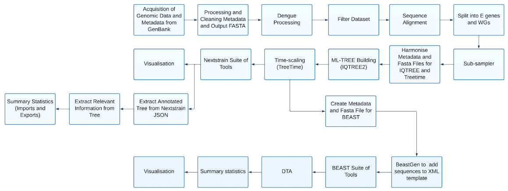

# Introduction

This pipeline is designed for the retrieval, processing, subsampling, and phylogenetic analysis of the latest dengue virus sequences. It leverages Snakemake, a powerful workflow management system, to ensure reproducibility and efficiency in bioinformatics analyses.

## Pipeline

Here is an overview of the pipeline that we will construct. For simplicity (and due to the extended runtime of some software) we will implement the main pipeline in this tutorial, disregarding the `BEAST` branch.



## Step by step of the pipeline

The pipeline consists of a series of sequential steps, but there are also branches to provide analysis of 4 Dengue serotypes. A partial graph of the generated Snakemake workflow is shown below. While this may look intimidating, we can construct the workflow step-by-step in a straightforward manner using GRAPEVNE modules.


We will cover the details of the branching structure later, but for now, let's focus on the main steps:

```{graphviz}
:name: dengue.workflow
:caption: Dengue workflow
:alt: alt
:align: center
digraph G {
    rankdir = UD;
    node [shape = box];

    n1 [label="Acquire data from GenBank"];
    n2 [label="Clean data"];
    n3 [label="Filter sequences"];
    n4 [label="Split by serotype"];
    n5 [label="Verify Serotypes and Genotypes"];
    n6 [label="Sequence alignment"];
    n7 [label="Segregate E gene and Whole Genomes"];
    n8 [label="Subsampler"];
    n9 [label="File format conversion"];
    n10 [label="Treebuilding"];
    n11 [label="Time-calibrated trees"];
    n12 [label="Infer 'ancestral' mutations across the tree"];
    n13 [label="Translate sequences"];
    n14 [label="Discrete trait reconstruction"];
    n15 [label="Export for visualisation"];
    n16 [label="Extract annotated tree"];
    n17 [label="Extract information from tree"];
    n18 [label="Quantify exports and imports from desired country"];
    n1 -> n2 -> n3 -> n4 -> n5 -> n6 -> n7 -> n8 -> n9 -> n10 -> n11 -> n12 -> n13 -> n14 -> n15 -> n16 -> n17 -> n18
}
```

The steps in the pipeline are as follows (see the [Dengue repository](https://github.com/rhysinward/dengue_pipeline) for more details):

1. Acquisition of Genomic Data and Metadata from GenBank
2. Clean metadata and FASTA files
3. Filter for sequences from SEA
4. Split into serotype, add serotypes to sequence name and generate sequence specific metadata
5. (Future step not currently implemented) Verifying Serotypes and Genotypes
6. Sequence alignment
7. Segregating E gene and Whole Genomes and performing quality control
8. Subsampler
9. Correct metadata and fasta files into the correct format for iqtree and treetime
10. ML-Treebuilding
11. Build time-calibrated trees
12. Infer "ancestral" mutations across the tree (nextstrain)
13. Translate sequences (nextstrain)
14. Discrete trait reconstruction (nextstrain)
15. Export for visualisation in Auspice (nextstrain)
16. Extract annotated tree from nextstrain JSON format
17. Extract information from tree
18. Quantify number of exports and imports from desired country
