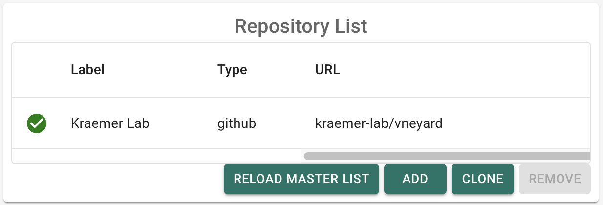
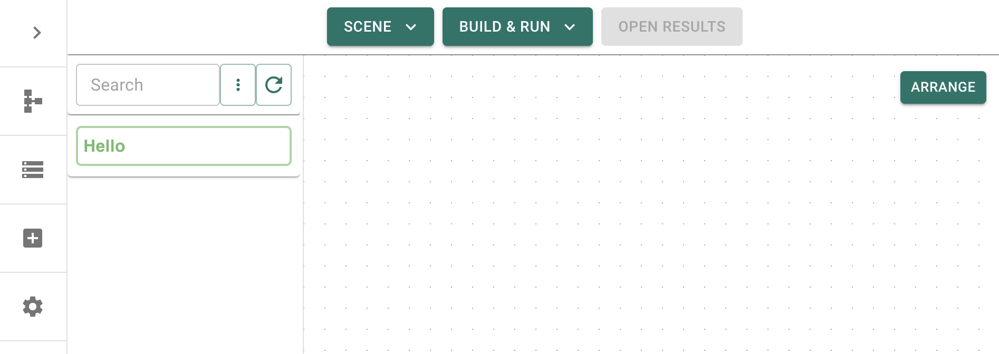

# Module repositories

To use GRAPEVNE you will need to have access to one or more module repositories. These are collections of modules that you can use to build your workflows. You can create your own module repositories, although we recommend sticking with the defaults for now if you are new to GRAPEVNE.

```{note}
You don't need your own module repository to start use GRAPEVNE, there is a default repository that includes all modules necessary for the tutorials (along with many others).
```

A module repository is simply a folder that is structured in a particular way. These can be stored locally on your machine or on a remote provider such as GitHub. We recommend setting your repository up directly in GitHub and then cloning it to your computer for use (instructions below) as this will make it easier to version-track, share and collaborate with others at a later date.

We provide a GitHub template that you can use to set-up your repository. To use this template you must have a GitHub account. Then, navigate to the [vneyard-template](https://github.com/kraemer-lab/vneyard-template) repository and click the green "Use this template" button. You will be asked to provide a repository name (e.g. `vneyard`) and whether you want to make the repository Public or Private at this time. Once done, a new repository will be created in your GitHub account with the correct structure.

```{note}
The template also provides several quality-of-life features such as a README template and a GitHub Actions workflow to check your modules for errors when uploading. We also provide an action to generate a module manifest file for you each time changes are made to your repository. These actions are not required, but are recommended to improve usability.
```

You can now download modules from this repository directly (we provide one sample module to get you started), or clone the repository to your local machine in order to make changes and start adding your own modules and workflows.

## Remote access (read-only)

To access the repository immediately, open GRAPEVNE and go to the `Settings` panel. Click `Add` (found in the `Repository List` pane) to add your repository to the list, ensuring that you give it a name (e.g. `my-vneyard`), the correct type (`github`) and the GitHub URL (this is your github tag followed by the repository name, e.g. `kraemer-lab/vneyard`):

[](images/repo_settings.png)

To test that everything is working as expected you can disable the default repository (`kramer-lab/vneyard`) and just enable your own repository. Then return to the main `Canvas` screen refresh the modules list. If everything is working correctly you should see the modules from your repository appear in the list. If you followed the guidelines above and have used the template repository, you should see a single module called `Hello` in the list:

[](images/repo_list_hello.png)

## Local access (read and write)

To make changes to the repository it is necessary to 'clone' (make a local copy) of the repository from GitHub onto your local machine. This can be done from GRAPEVNE by navigating to the `Settings` panel and clicking the `Clone` button (found in the `Repository List` pane). You will be asked where to save the repository on your computer, at which point the repository will be downloaded and added to your repositories list. _Note: you only need to have the clone in your repositories list, since this provides access to all of your GitHub modules, and allows you to make changes to them / add new modules._

Any updates made to the repository on GitHub will be indicated to you through the GitHub icon (that appears next to the 'local' repository entry in the repositories list).

If you make changes to any of the modules in your repository, or add new modules, the GitHub icon will likewise indicate those changes and signify that these can be 'pushed' to the repository on GitHub. This way we can keep the local ('working copy') and remote ('published') repositories in sync with each other.

## Folder structure

There is generally no need to work directly with the repository structure, but for the curious the structure of a module repository should look like this:

```
vneyard                     <--- root repository folder
└── workflows               <--- 'workflows' folder (name must match)
    └── MyModules           <--- project name
        └── modules         <--- 'modules' folder (name must match)
            └── MyModule1   <--- module folders
            └── MyModule2
            └── MyModule3
```

The folders `workflows` and `modules` are required names, whereas the names of
the base repository folder (`vneyard`, the project name `MyModules` and the
list of modules themselves (e.g. `MyModule1`) can be changed.
