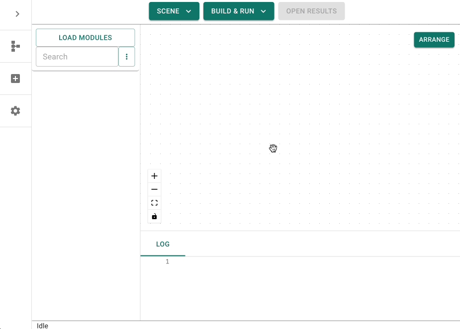

# Quickstart

This guide will help you get up-and-running with GRAPEVNE.

1. Download GRAPEVNE (see [Installation](#installation))
2. Open GRAPEVNE on your local machine
3. Select 'HelloWorld' from the Projects dropdown (or type 'Hello' into the module search bar)
4. Drag-and-drop the 'Hello' module onto the canvas
5. Click 'Build & Run' - 'Test Build'

See the [Troubleshooting](#troubleshooting) section if you encounter any issues.

The full process is illustrated below:


(troubleshooting)=
## Troubleshooting

### GRAPEVNE does not start after download

Ensure that you have downloaded the most recent version (see [Installation](#installation)) and that you have not renamed the binary (executable or .app file).

### The module list does not appear

This quickstart guide assumes that you have just downloaded GRAPEVNE and are using the default repository. If any problems occur, it is likely that the repository is not set up correctly. Go to `Settings` (from the side navigation bar) and under `Repository List` check that you have the following repository set up and enabled (or click `Reload Master List` to reset to the defaults):
```yaml
Label: kraemer-lab
Type: github
URL: kraemer-lab/vneyard
```


### The 'Hello' module does not appear in the module list

Ensure that you have the correct repository set up (see above) and that the repository is enabled in the `Repository List` settings. You may have other repositories listed that can be disabled for testing.

### The 'Hello' module does not run

Try cleaning the build folder before running the module. This can be done by clicking the 'Delete Test Build' button in the 'Build & Run' drop-down, then trying the `Test Build` again.

### The problem is not listed above

Please see our list of [known issues](https://github.com/kraemer-lab/GRAPEVNE/issues) on GitHub, and consider reporting the problem back to the developers.
