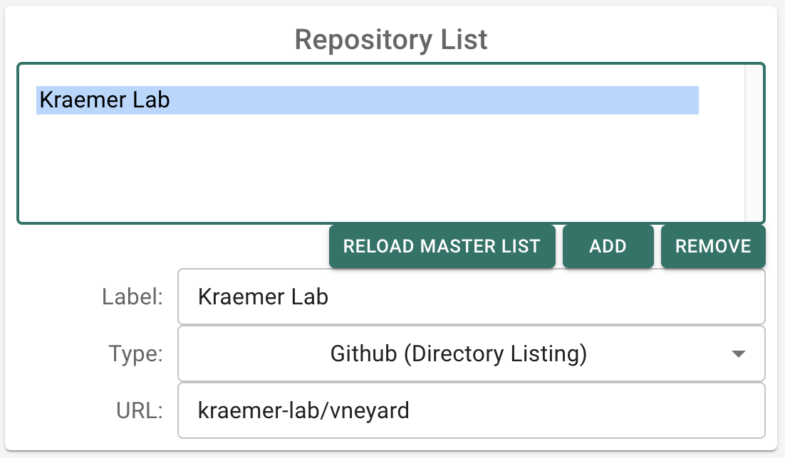

# GRAPEVNE Builder

GRAPEVNE Builder is the graphical interface that assists you in graphing, manipulating and building GRAPEVNE workflows.

This tutorial will provide a quick introduction to the GRAPEVNE Builder app (see Installation instructions) that will include how to construct, build and run a simple workflow using several modules that are already available online.

For this tutorial we will download, process and visualise some publically available Covid-19 data.

## Loading modules

To begin, open GRAPEVNE. This should start the application in the 'Builder' screen, where you will construct and test-run your workflows.

There are various options available at the top of the screen. For this tutorial we will make use of pre-constructed modules available through our online repository. This should be the default setup if you have just installed GRAPEVNE, but you can check the repository list by clicking on the `Settings` option from the sidebar.


To access the repository ensure that 'Directory Listing (github)' is selected from the repository drop-down box at the top of the screen, and that `kraemer-lab/vneyard` (note the spelling) is displayed in the repository field.



Return to the main ('builder') screen, and click `Get Module List`. A message (`Loading remote modules`) will display while the listing loads. This will take a few seconds and you will know when it completed as the list of available modules will display on the left-hand side of the screen.

The module list is filterable - for this session we are interested in only the `Tutorial Builder` modules, so select this from the filter drop-down box (which is currently displaying `(all)`).


## Adding your first module

In this tutorial we are interested in the number of new cases of Covid-19 that were reported to the World Health Organisation (WHO) at different times and across different countries. In particular, we will visualise the number of new cases reported for a single country across all available time periods, and then aggregrate these cases by month in order to assess for seasonal dependencies. _Please note that this is being used as an example pipeline and does not take into account many factors including government restrictions and inter-annual variability that will affect the interpretation of these results._

Let's now add your first module: drag the `Download` module from the list on the left-hand side of the screeen into the central graph area. This is a simple module that will download a file to your computer. Once it has appeared on the graph you can click on the node/module to edit its parameters. This module has been set up (by default) to download the `GRAPEVNE` logo from our website. However, we want to change this to download the WHO data.

## Modify module parameters

Click on the module and take a moment to look through the parameters list that is displayed on the right-hand side of the screen. We want to alter both the `url` and `Filename` parameters for this test. In the `url` field, change the URL to the following:

```
https://covid19.who.int/WHO-COVID-19-global-data.csv
```

In addition to changing the URL location, we also want to rename the file after download for convenience. We can do this by editing the `filename` field (`config-params-filename`) and changing it to `data.csv`.


## Connect modules together into workflows

We will now add two mode nodes to the graph. First, add the `Filter` node. The WHO dataset contains information on many countries, but we want to limit our analysis for the time being. Select the node and notice that there is a `Country_code` field under `config-params-Filters`. That is because this module has been set-up to filter based on a list of fields, and field values. We can change this country code, or leave it as it is. For now we will leave it set to its default value of `GB` (Great Britain).

Next, ensure that the output from your `Download` module connects to the input to your `Filter` module. To do this, note that the upper and lower regions of blue modules correspond to input and output ports, respectively. Green modules are distinguished as having only output ports (they do not require inputs to run). Move your mouse until the `Out` port is highlighted, then click-and-drag a connection between the `out`-port of the `Download` module and the `in`-port of the `Filter` module.

It's as simple as that! When the workflow is 'built', these modules will pass information to each other so that when the workflow is 'run', the files are processed correctly.

We could run the workflow at this point, but we wouldn't see any output (because we haven't asked for any). Let's add one more node and then build our first working workflow.

Drag the `Plot` module from the list available on the left-hand side of the screen into the canvas area, and connect the `Filter` node to it. Leave its parameters set to the defaults (for now). Now we are ready to (test) run our first workflow...

## Test run a workflow

GRAPEVNE is designed to build workflows into self-contained files that can be shared with others. However, we don't currently want to do that. Instead, want to 'test' the workflow out and see if it does what we expect. To assist us in this, GRAPEVNE provides a `Build and Test` button (at the top of the screen) that will first build the workflow file(s), and then execute them in a reserved directory.

Before we run our workflow you will need to tell `snakemake` to make use of `conda` environments - these are preconfigured as part of our modules, but we need to tell `snakemake` to use them (as opposed to running natively, through `singularity` containers, or even in the cloud). To do this, click on `Settings`, then ensure that `Snakemake` - `arguments` says:

```
--cores 1 --use-conda --force
```

- `--cores 1` indicates that we are using one CPU core (we can specify more to process our pipeline branches in parallel)
- `--use-conda` tells `snakemake` to make use of `conda` environments (these can be turned off, or replaced with `singularity` containers, depending on the environment in which we run our workflows).
- `--force` forces snakemake to re-run the full workflow, even if all of the output files are already present. You won't typically use this, but for the tutorial it is useful as it recreates the diagram each time we click `Build & Run`.

```{note}
The software packages that we use and specify in our `conda` environments are available on a range of different platforms. However, it seems as though some of the software that we depend on has not yet been built for the latest Apple Mac hardware. Specifically, if you are using an Apple Silicon device (those with 'M'-series chips), and are having problems running the tutorial, then try adding `CONDA_SUBDIR=osx-64` to the snakemake arguments list (as described above). This will force conda to use the Mac Intel-chip builds on your computer - these should run fine, although may not be as performant as native code.
```

We are about to run a workflow, but as this is the first time the workflow has run on your computer, it first needs to download the environment files, set-up its runtime environment, and then launch the various steps of your workflow. This can take a few minutes on a first run (but is very much quicker after that).

Try this now: click `Build and Test` and keep an eye on the `Log` to monitor progress. This is the perfect time to grab a fresh cup of tea while the environment loads...


## Your first graph

You can monitor the status of your workflow from the `Log`, but if all goes well then you should see a figure pop-up onto your screen displaying the number of new Covid-19 cases that were reported to the WHO over an extended period of time. Since this plot is being displayed as part of the `Plot` module, the workflow will pause at this point until you close the figure. Do this now.

Congratulations - you have successfully completed your first test build.

It is at this point that it is worth remembering that despite the ability to visualise data, GRAPEVNE is not designed an interactive data mining and visualisation package. Visualising data is useful as a tutorial example, and can be very useful to periodically inspect the results of analyses, or to manually-inspect pre-processed inputs prior to starting long jobs.

## Extending the graph

Let us now extend the analysis by considering seasonal variations. With your previous graph entact, add a new node `AggregateByMonth` and connect the output of the `Filter` node to it. _Note:_ This means that we are connecting the output of the `Filter` node to two separate modules: the `Plot` module, and the `AggregateByMonth` module. We have therefore demonstrated branching workflows.

You can inspect the parameters of the `AggregateByMonth` module by clicking on it, although we will leave those parameters set to their defaults for now. Finally, connect a _second_ `Plot` module to the output of `AggregateByMonth`.

## Run your extended graph

Click on `Build and Test` to run your extended graph. Since a lot of the set-up process was completed on the first run (although not all - we have added new nodes), this should execute much more quickly than before.

If, after a few second, both graphs appear on your screen then the two branches of your workflow have run independently and have stopped at the two `Plot` modules.

If, after a few second, only one graph appears, then this is because you are running snakemake using only a single core, which limits snakemake to run only one module at a time. Closing the graph will allow the second branch to run, and after a few more seconds of processing time, the second graph will appear, revealing the seasonal fluctuations in new Covid-19 cases by month (numbered 1-12 in this case) for our selected country.


## Changing parameters

As you have seen already, changing the parameters of this analysis is extremely easy, you simply have to edit them by clicking on the relevant modules. Try this now by changing the country of interest from `GB` to another country. Click `Build and Test` to launch the analysis.

```{note}
Snakemake will know that the parameters of the analysis have changed and will automatically re-process the necessary steps to produce the required analysis.
```

## Building workflows for use outside of GRAPEVNE

Although this extends slightly beyond the basic usage of GRAPEVNE, it is useful to consider two scenarios where we may want to build a workflow and distribute it. The first is building the workflow for others to use, outside of GRAPEVNE.

Once you are happy with your workflow you can click `Build as Workflow`. This will produce a zip file containing a Snakefile (the default Snakemake workflow format), and the accompanying configuration files that to allow your workflow to be run outside of GRAPEVNE.

For example, to run your newly created workflow called `build.zip` outside of GRAPEVNE, simply unzip it, move into the `build` folder launch the workflow by typing `./run.sh`.

This will launch the same series of steps as the `Build and Test` button, but without needing the GRAPEVNE application. There is also a `./build_container.sh` script for creating a container from the provided `Dockerfile`, and `./run_workflow.sh` which launches the container. These can be run locally, or remotely (i.e. cloud compute), as required.

## Building workflows for use as modules

The second basic scenario of workflow usage is using GRAPEVNE to create workflows composed of hierarchies of modules. This requires us to be able to make module from existing modules. Thankfully this is incredibly straightforward since there are no special requirements to build a workflow for use as a module. In other words, any workflow build that you create can be imported and used as a module (so long as the graph is _valid_, more on this in a future tutorial). Clicking `Build as Module` creates a module, which is identical to the `Build as Workflow` button, except that we do not include the launch scripts, as modules are not intended to be launched independently. Once you build the module and unzip it, GRAPEVNE is able to read the configuration file and load the module ready for use. If all of the workflows input ports were connected then the resulting module will have no input ports itself, but if some input ports were left unconnected, then these will be exposed in the editor for use.

## Summary

You are now able to build a workflow to either

1. distribute to others for use, or
2. use as a module in another workflow

Indeed, it is this form of hierarchical modularization that makes GRAPEVNE so powerful. However, to demonstrate this we will want to set-up our own repository for testing (which we discuss in the next set of tutorials). 
## Wait, but why is the workflow so slow on a first run?

You may be wondering why the workflow was so slow to execute on its first run. After all, it was simply reading a file, filtering it, and plotting the result. The answer is that each module was set up to operate within a _conda_ environment. These configurations come with the modules so that you don't have to worry about them when building your workflows. Essentially, the conda environments set-up an isolated environment and download all of the necessary software to execute the contents of each module in a highly reproducible manner. Further details of conda environments and how snakemake / GRAPEVNE makes use of them are available in the next set of tutorials. 
