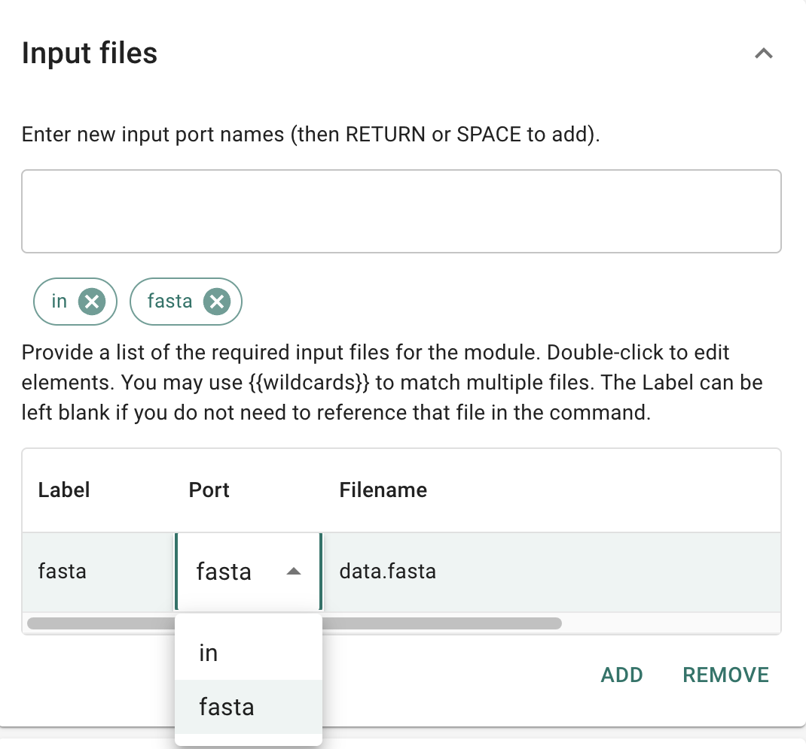

# Module Editor

The Module Editor is a accessible from the sidebar navigation panel in GRAPEVNE.


The Module Editor is used to create and edit modules. A module is a collection of scripts, resources, and other files that can be used to perform a specific task. Modules can be shared with other users, and can be used to create workflows.

The Module Editor is divided into several sections, each of which is described below:
- [Repository](#repository)
- [Description](#description)
- [Input files](#input-files)
- [Output files](#output-files)
- [Parameters](#parameters)
- [Environment](#environment)
- [Scripts](#scripts)
- [Resources](#resources)
- [Commands](#commands)
- [Build](#build)

(repository)=
## Repository

Give your module a name, and select where it will be saved. You can save the module to a Project folder in a local repository, or to a zip file. You cannot save a module directly to a remote repository, although you can save to a local clone and then commit those changes manually.

There is also an option to export and import module configurations, which can be helpful when developing the module. At present you cannot import a 'built' module.


(description)=
## Description

Provide a description of the module. This should include a brief description of what the module does, and any other relevant information. You should include a `Ports` section if there are multiple inputs, and a `Params` section if there are any parameters that can be set. For example, a simple `Email` module might look like this:
```
Send email

This module sends an email.

Inputs:
    credentials: The path to the credentials file.
    attachments: The path to the attachments.

Params:
    Credentials:
        Filename (str): The name of the credentials file.
    Server:
        SMTP Server (str): The SMTP server to use.
        SMTP Port (int): The port to use for the SMTP server.
    Message:
        Subject (str): The subject of the email.
        Body (str): The body of the email.
        Recipients (str): A comma separated list of email addresses to send the email to.
        Attachments (list[str]): A list of filenames to attach to the email.
```

(input-files)=
## Input files



(output-files)=
## Output files

Output files are the files that are generated by the module. These are typically used as input to other modules in the workflow graph, so it is important that any files that may be read from the module are specified here (otherwise the workflow manager will not know where to find them).

These are specified in the same way as input files, but without the need to specify a `Port`.

(parameters)=
## Parameters

Parameters are provided in [YAML](https://yaml.org/) format. For example:
```yaml
param_str: "hello"
param_num: 12
```

(environment)=
## Environment

GRAPEVNE is built on Snakemake which makes heavy use of `conda` as its environment manager. This means that you can specify the environment that the module should run in by providing a `conda` environment file. This file should be a `yaml` file that specifies the dependencies that the module requires.

For example, here we see how to specify a `conda` environment file that specifies that the module requires `numpy` (a Python library). In order to install `numpy`, we need to specify that we want to use the `pip` package manager, and then specify that we want to install `numpy` using `pip`. Note that we *do not* need to specify the `python` package (unless we specifically want to pin to a particular version of Python), as snakemake runs through Python anyway (and this produces a smaller conda environment).
```
name: myenv
channels:
  - bioconda
  - conda-forge
dependencies:
  - pip
  - pip:
    - numpy
```

(scripts)=
## Scripts

Provide any custom scripts that you want to use in your module here. You are not limited to a particular programming language, so long as your environment file has provided the necessary dependencies. For example, you could add Python, R, or even shell scripts here. Scripts are added as a module input / requirement, and can be referenced in the `Commands` section by their input `Label` (e.g. `inputs.scriptlabel`).

(resources)=
## Resources

Resources are payloads / additional files that are provided with the module. These can be specific datasets or settings files, but are typically not scripts.

(commands)=
## Commands

In the commands window you should specify the commands to run, taking care to ensure that any parameters are passed appropriately to the command. For example:
```
python {input.script} --input {input.infile} --output {output.outfile} --param {params.setting1}
```

(build)=
## Build

Build the module. If a local repository is specified, the module will be built and saved to the local repository. If the zip option is selected, the module will be built and saved as a zip file. You cannot save a module directly to a remote repository, although you can save to a local clone and then commit those changes manually.
