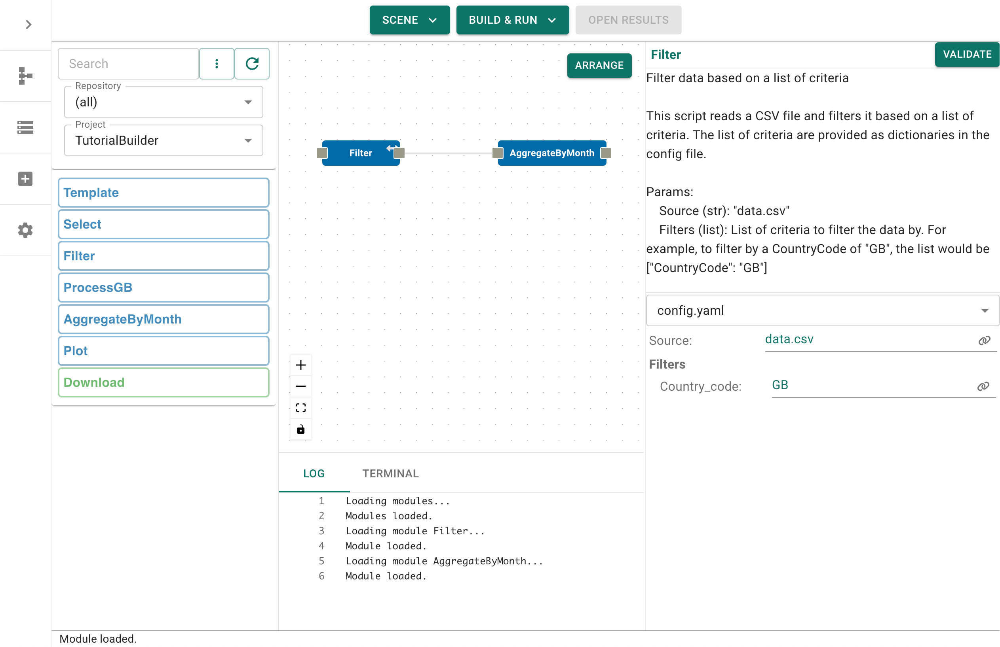
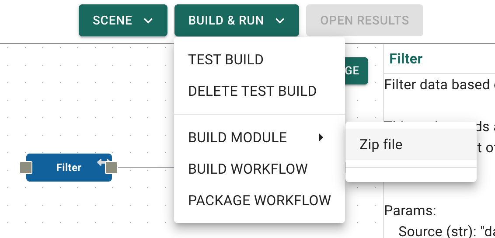
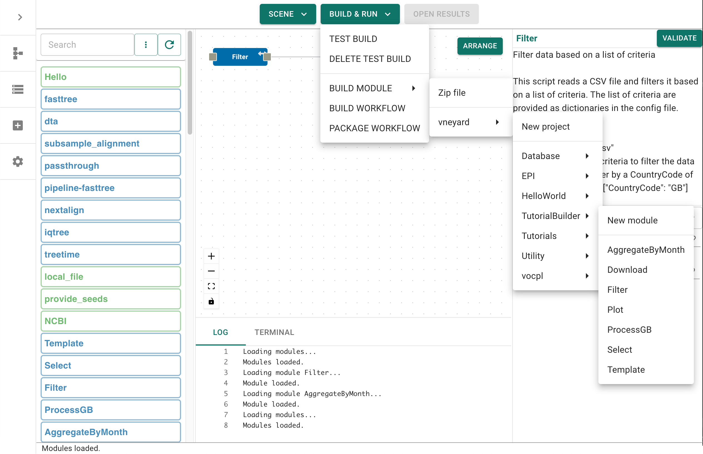
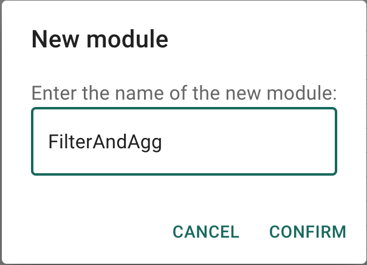
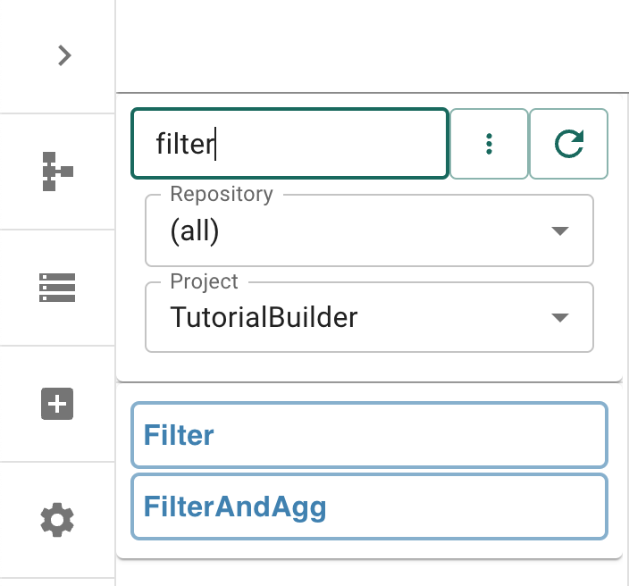
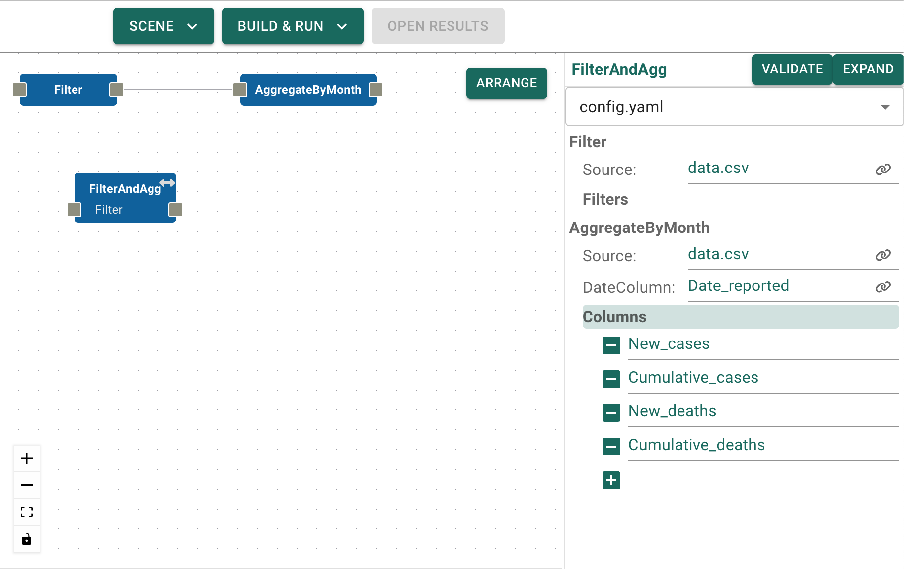
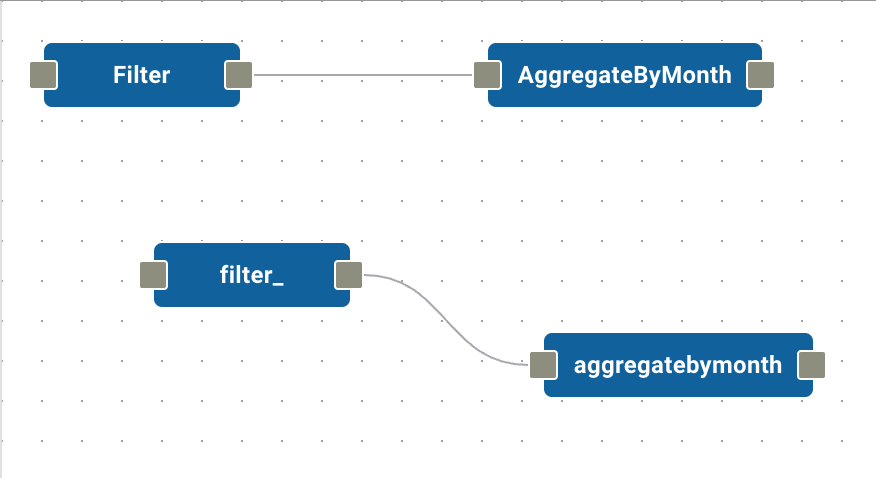
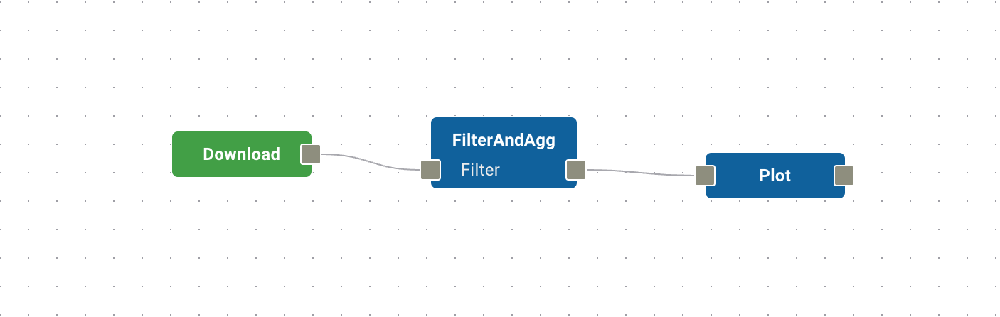
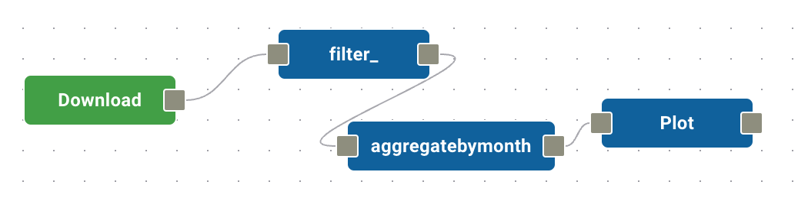

# Sub-modules

```{note}
You will also need an (editable) local repository set up for your modules - either a clone or just a local folder with the correct directory structure. If you do not have these, or are unsure, then please read the [module repositories](../../getting_started/module_repos.md) page before continuing.
```

One of the great benefits of modular construction is the capacity to (re)-use
components in a hierarchy - providing high level modules that make use of lower
level modules to provide abstraction, accessibility and reuse. We can
demonstrate this principle by making use of the previous tutorial modules.

So far we have made use of pre-constructed modules that are published online.
Now, we want to make use of these modules to construct module grouping, and to
make use of those groupings in a hierarchical fashion. This requires us to be
able to store our modules somewhere - specifically, in a repository.

Let us begin where we left off in the previous tutorial [Build your first workflow](../../getting_started/build_a_workflow.md). Make sure you have `kraemer-lab/vneyard` in your repository list and that it is enabled. Ensure that you also have a local (editable) repository available in your repositories list. If you do not have a local repository, then you can create one by following the [module repositories](../../getting_started/module_repos.md) guide.

## Build a workflow

Drag the `Filter` and `Aggregate` modules onto the Canvas and connect the output of the `Filter` module to the input of the `Aggregate` module. This will create a simple workflow that filters the data for a specific country and then aggregates the data by month. However, notice that we have not provided any data as input, or done anything with the output... at least not yet. Your basic workflow at this point should look as follows:



Let us imagine that we want to reuse these two steps in future workflows, so we want to build a Module out of them. To do that, we simply have to save them as a 'Module'. _Remember: a module is like a workflow, but must only have one output._ Click on `Build & Run` and then select `Build Module` from the dropdown menu.

```{note}
If you have a local (editable) repository available in your repositories list, then you will be able to navigate that repository and save the module there. If not, you will only be provided with the option to `Save to zip`.


```

For this tutorial, we want to save the module into our editable repository, into the `TutorialBuilder` project. If that project does not yet exist then select `New Project` and enter the project name (it does not have to match `TutorialBuilder`, that is simply chosen for convenience). Once this is done navigate to that project and select `New module`.



When prompted, enter a name for the module, e.g. `FilterAndAgg`, then click `Confirm`. This will save the module straight into your repository and refresh the modules list for you.

Let's find your new module in the repository list - consider filtering by Project, and/or using the freetext search to find your module.



Once you have found it, drag the module onto the canvas. Select the module on the canvas so that the information panel appears. Within the information panel you will see a list of all the modules contained within `FilterAndAgg`. You can expand these to see the details of the modules, and can edit them directly from here.



While viewing the module information you may have noticed the presense of a new button in the top-right corner. The `Expand` button is available as this is a module containing submodules. We can therefore expand the module to recover it's original structure. Let's do that now.



As you can see the module has expanded to reveal the `Filter` and `Aggregate`, connected in the correct order. By comparing these modules to the original workflow you can see that the workflow has been faithfully reconstructed, although some of the module names may have changed to prevent conflicts.



Let's try running some workflows with the new module. First, clear the scene by selecting `Build & Run` and then `Delete Test Build` from the drop-down menu. Now drag the `FilterAndAgg` module onto the canvas, along with the `Download` module and the `Plot` module. Connect them together so that `Download` - `FilterAndAgg` - `Plot`. Remember to change the parameters of `Download` so that we download the correct data:
```{yaml}
url: https://covid19.who.int/WHO-COVID-19-global-data.csv
Filename: data.csv
```

Launch the workflow with `Build & Run` - `Test Build`. Remember that the workflow will need to set-up it's conda environments again, which may take a minute or so.  You should see the familiar graph pop up on screen when the workflow is done.



Finally, let's confirm that the module still works when deconstructed. Click on `FilterAndAgg` and select `Expand` from the information panel on the right. Notice that the module not only expands its contents, but retains appropriate connections to its neighbours.



Run the workflow for a final time by selecting `Build & Run` - `Test Build`. You should see the same graph as before.

The ability to manipulate parameters within submodules is extremely useful, but modules can also be expanded so that entire sub-modules replaced if needed, providing a high level of flexibility.
