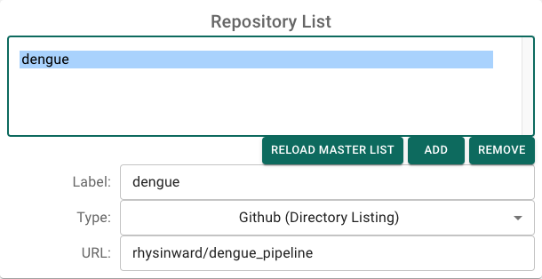
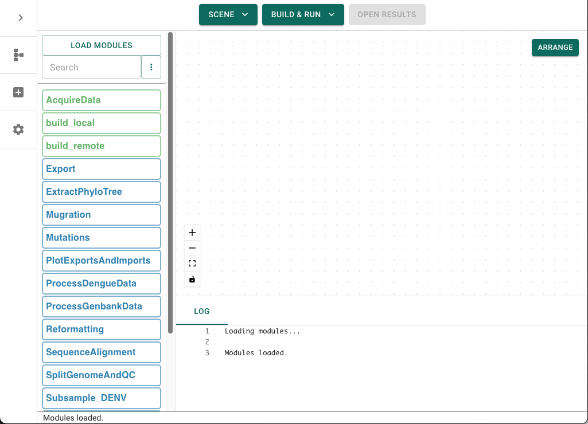

# Acquiring the data

To begin, open GRAPEVNE and navigate to the `Settings` screen so that we can add the [Dengue repository](https://github.com/rhysinward/dengue_pipeline) to our list in order to access the modules.



Return to the main ('Builder') screen and click `Load Modules`. After a few seconds you should see the module list populate.



Click and drag the `AcquireData` module into the workflow canvas. This module is responsible for downloading data from the NCBI repository. Click on the new module to configure it. An explanation of the module and its parameters will pop-up, along with a list of editable parameters.


Let's pause and test the workflow with just this one module. Click the `Build & Run` button at the top of the screen, then click `Test Build`. This will build and run the workflow.

```{note}
If is often a good idea to `Delete Test Build` at the start of a new project to ensure that there are no leftover configurations from previous runs. However, this removes any conda environments that have been created for your workflow, so only do this on subsequent runs if you are sure you want to start afresh. If you need to force execution to a particular module (perhaps because a target file already exists), then simply right-click on that module and select `Run To Module (Force)`.
```

When it is complete the `Open Results` button will be enabled - click it now and you will be taken to the `testbuild` folder which contains a `results` folder. The results folder should now contain the following data, corresponding to the parameters you specified in the `AcquireData` module:
```bash
.
└── acquiredata
    ├── README.md
    ├── genbank_data.zip
    ├── metadata.tsv
    └── ncbi_dataset
        └── data
            ├── data_report.jsonl
            ├── dataset_catalog.json
            ├── genomic.fna
            └── virus_dataset.md
```
