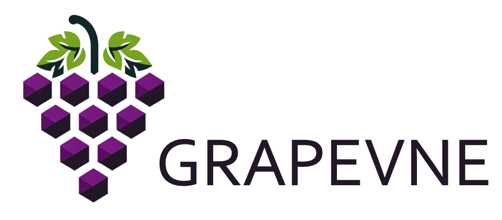

# GRAPEVNE




GRAPEVNE (*Gr*aphical *A*nalytical *P*ipelin*e* De*v*elopme*n*t *E*nvironment) is a desktop application that provides an interactive graphical environment for designing and building hierarchical analytic workflows.

GRAPEVNE is an interactive environment for building and validating data processing workflows built around the [Snakemake](https://snakemake.github.io/) workflow manager. The grapevine is a symbol of growth, development, and productivity, highlighting the software's ability to help users grow and develop their analytical pipelines. It was originally focussed on solving phylogenetic problems, but has developed to support a broad range of use-cases.

```{toctree}
---
caption: Background
maxdepth: 1
---
Background
```

```{toctree}
---
caption: Getting started
maxdepth: 1
---
getting_started/installation
getting_started/quickstart
getting_started/tutorial
getting_started/creating_modules
```

```{toctree}
---
caption: Use-cases
maxdepth: 1
---
use-cases/index.md
```

```{toctree}
---
caption: Have a question?
maxdepth: 1
---
CONTRIBUTING
```
